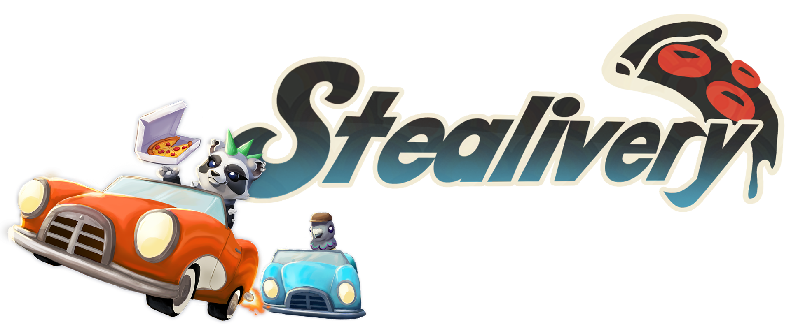

 **Stealivery is a 2-player local coop 3D game. By playing in two different modes, you have to prevent your opponent from collecting more points than you.**

 Stealivery was developed as a student project at the [S4G School for Games](https://www.school4games.net) in late 2024 / early 2025.

 Play it on [Itch.io](https://s4g.itch.io/stealivery)!
 
 # Gameplay

 **Delivery Madness**

In Delivery Madness you have to deliver the most Deliveries. Pick them up at the restuarant and be the first one to deliver them. Be careful though! Your opponent can steal parts of your delivery and make those points instead of you! 

**Delivery Thief**

In Delivery Thief you have to capture the delivery first and keep it for as long as possible. Your opponent wants to make points too, so they'll have to steal it back from you. 

# Tools

The game was developed using the Unreal Engine 5.5, Blueprints and minimal C++.  
We used Perforce for version control.

# Responsibilities
As I was the only engineer on the project, I was responsible for most of the blueprint and engine work. This included all of the programming part and the implementation of the user interface.

# Highlights
(Links lead to [Blueprints UE](https://blueprintue.com))  

**[Player Car](https://blueprintue.com/blueprint/tzexudlu/)**  
The player car was created using the Unreal Chaos Vehicle plugin. I developed a Base Player Car Blueprint that the Player Car inherits from, allowing me to modify the vehicle's code without affecting the work of other team members.
